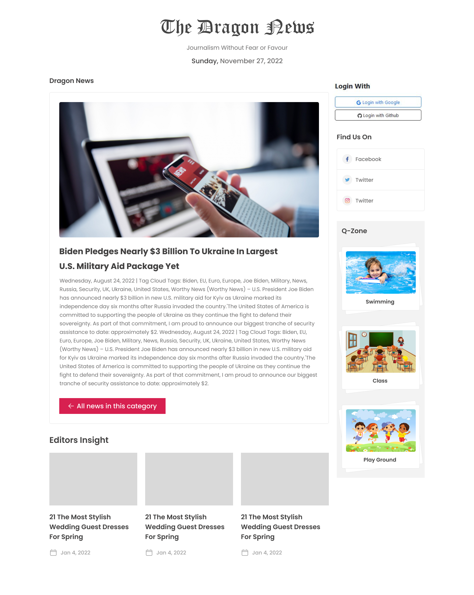

# 📰 Dragon News

Welcome to **Dragon News**, a Firebase-hosted React application that displays the latest news updates. Built with modern frontend tools and libraries, this app offers a smooth user experience, secure authentication, and a clean design using React,Tailwind CSS and DaisyUI.

🔗 **Live Site:** [https://dragon-news-c4d23.firebaseapp.com](https://dragon-news-c4d23.firebaseapp.com)

# Responsive version commig soon

---

## 🚀 Features

- ✅ **Public News Access** – Anyone can read general news without login.
- 🔐 **Protected Routes** – Users must log in or register to view full news details.
- 👤 **Firebase Auth Integration** – Secure login/registration via Firebase.
- 🧭 **React Router & Private Routes** – Smooth, protected navigation.
- 🎨 **Tailwind CSS & DaisyUI** – Stylish and clean responsive design (currently desktop-first).
- 📡 **Dynamic Data Fetching** – News content is fetched from an external API for real-time updates.
- 📷 **Dynamic Profile Display** – Shows user name and photo after login.
- 📦 **Component-Based Architecture** – Easy to maintain and extend.

---

## 🛠️ Built With

- [React JS](https://reactjs.org/)
- [Firebase (Authentication & Hosting)](https://firebase.google.com/)
- [React Router DOM](https://reactrouter.com/)
- [Tailwind CSS](https://tailwindcss.com/)
- [DaisyUI](https://daisyui.com/)

---

## 📸 Screenshots

> 




---

## 🧪 Installation & Setup

To run this project locally:

1. **Clone the repository:**

   ```bash
   git clone https://github.com/mehediScriptDev/dragon-news-later.git
   cd dragon-news-later

